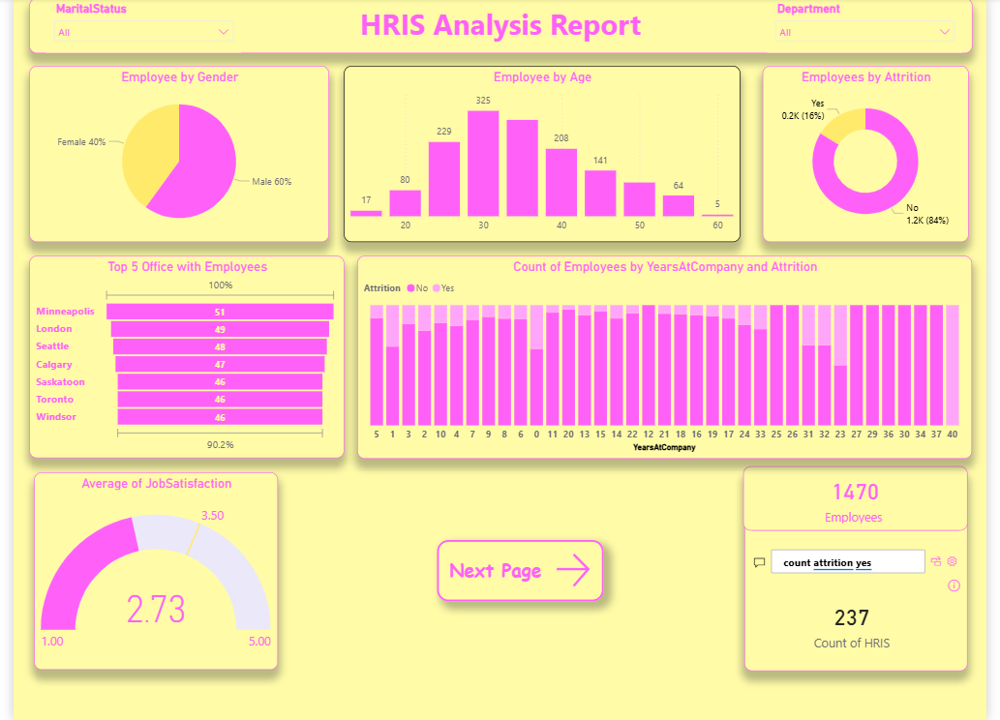
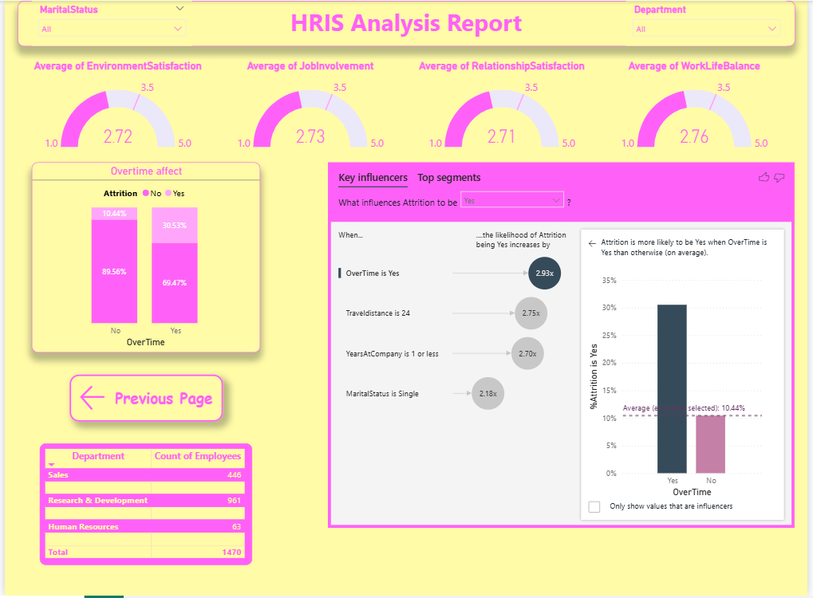

# PowerBI_HRIS_Dashboard

Interactive Power BI Dashboard for HRIS Analysis.

## Dashboard Preview

### Overview Dashboard

### Employee Analysis Dashboard

---

## Project Overview

This project provides an interactive HR analytics dashboard built using Power BI to help analyze workforce data and generate actionable insights.

The dashboard includes:
- Employee distribution analysis
- Attrition insights
- Gender breakdown
- Department performance tracking
- Age group segmentation
- HR KPIs and trends

---

## Tools & Technologies

- Power BI
- Power Query
- DAX
- Data Modeling
- Data Visualization

---

## Key Features

- Interactive slicers and filters
- Dynamic KPI cards
- Clean dashboard design
- Data-driven HR insights

---

## Files Included

- Power BI dashboard (.pbix)
- Dashboard screenshots
- README documentation

---

### Moustafa Ashraf

